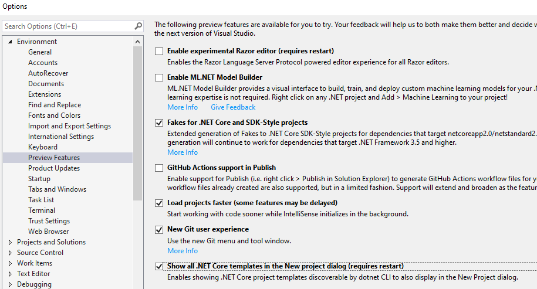

# Using Arcus templates in Visual Studio

The available .NET project templates in this repository are all available via the command line.
For example:

```shell
PM > dotnet new --install Arcus.Templates.WebApi
```

Which will install the template on your machine so it can be used for creating new projects:

```shell
> dotnet new arcus-webapi --name Arcus.Demo.WebAPI
```

However, you can also use our .NET templates in Visual Studio by following these steps:

1. Go to **Tools > Options** in Visual Studio
2. Navigate to **Preview Features**
3. Check the box **Show all .NET Core templates in the New project dialog**


